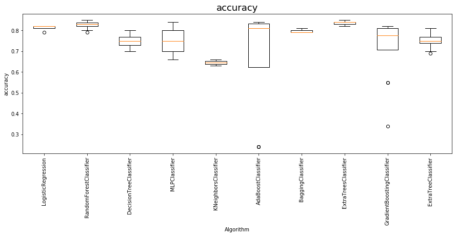
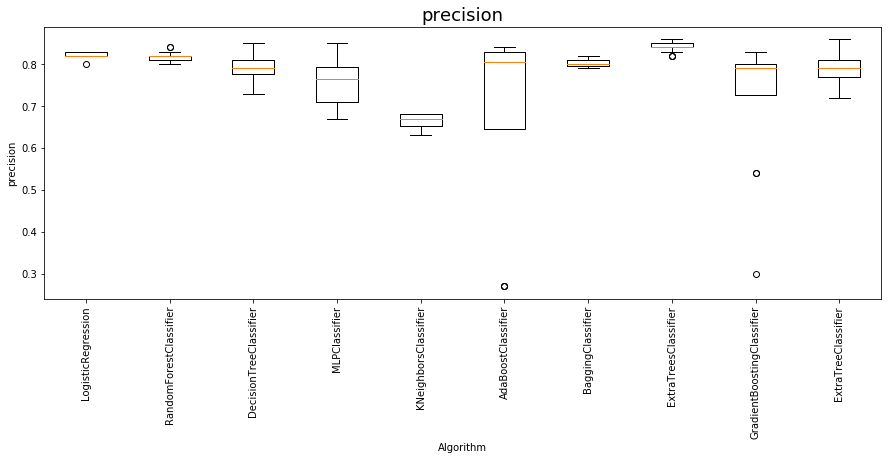
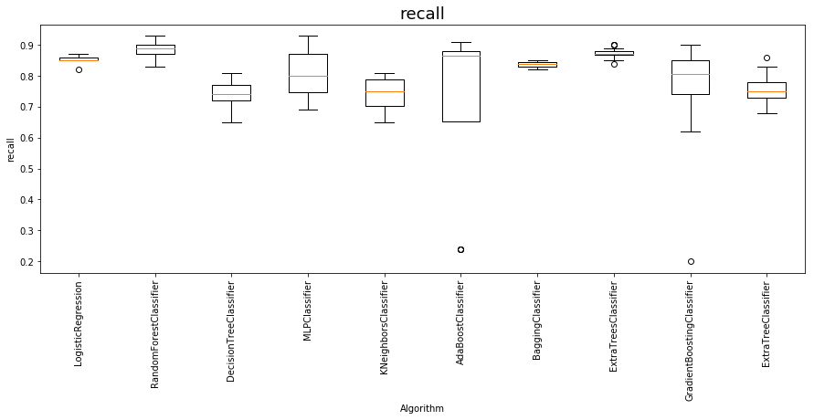
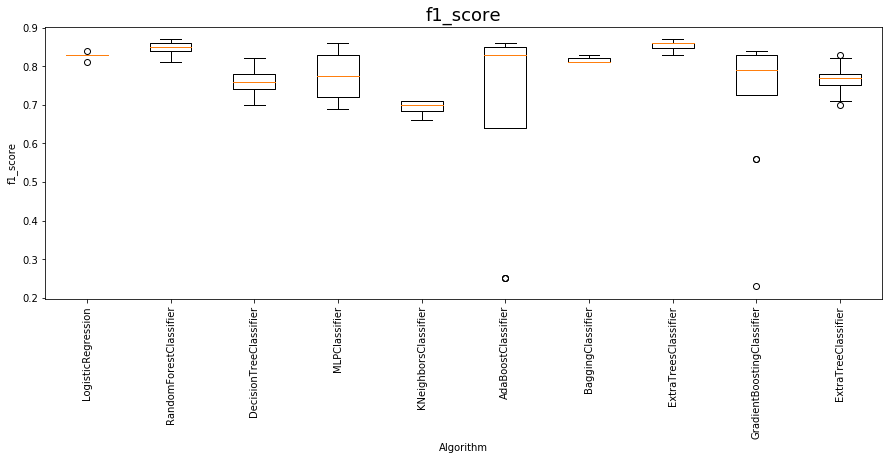

## Demo of Death2GridSearch

**Author :** Kevin O

**4/19/2019**

This is a demo of classification utility to select the best performing classifier based on desired metric. At the moment this is built for selection of `Classication` algorithms but can be expanded to gridsearch for `Regression` algorithms

Directory Structure
    1. setup - contains .yaml file defining the classifiers and hyperparameters. 
    2. data -  Folder containing sample data
    3. results - Final results of grid search. classifiers and hyperparams combinations are logged.


```python
from Death2GridSearch import *
import pandas as pd
```


```python
# load Data
data = pd.read_csv('data/heart.csv')
data.head()
```


<div>
<style scoped>
    .dataframe tbody tr th:only-of-type {
        vertical-align: middle;
    }

    .dataframe tbody tr th {
        vertical-align: top;
    }

    .dataframe thead th {
        text-align: right;
    }
</style>
<table border="1" class="dataframe">
  <thead>
    <tr style="text-align: right;">
      <th></th>
      <th>age</th>
      <th>sex</th>
      <th>cp</th>
      <th>trestbps</th>
      <th>chol</th>
      <th>fbs</th>
      <th>restecg</th>
      <th>thalach</th>
      <th>exang</th>
      <th>oldpeak</th>
      <th>slope</th>
      <th>ca</th>
      <th>thal</th>
      <th>target</th>
    </tr>
  </thead>
  <tbody>
    <tr>
      <th>0</th>
      <td>63</td>
      <td>1</td>
      <td>3</td>
      <td>145</td>
      <td>233</td>
      <td>1</td>
      <td>0</td>
      <td>150</td>
      <td>0</td>
      <td>2.3</td>
      <td>0</td>
      <td>0</td>
      <td>1</td>
      <td>1</td>
    </tr>
    <tr>
      <th>1</th>
      <td>37</td>
      <td>1</td>
      <td>2</td>
      <td>130</td>
      <td>250</td>
      <td>0</td>
      <td>1</td>
      <td>187</td>
      <td>0</td>
      <td>3.5</td>
      <td>0</td>
      <td>0</td>
      <td>2</td>
      <td>1</td>
    </tr>
    <tr>
      <th>2</th>
      <td>41</td>
      <td>0</td>
      <td>1</td>
      <td>130</td>
      <td>204</td>
      <td>0</td>
      <td>0</td>
      <td>172</td>
      <td>0</td>
      <td>1.4</td>
      <td>2</td>
      <td>0</td>
      <td>2</td>
      <td>1</td>
    </tr>
    <tr>
      <th>3</th>
      <td>56</td>
      <td>1</td>
      <td>1</td>
      <td>120</td>
      <td>236</td>
      <td>0</td>
      <td>1</td>
      <td>178</td>
      <td>0</td>
      <td>0.8</td>
      <td>2</td>
      <td>0</td>
      <td>2</td>
      <td>1</td>
    </tr>
    <tr>
      <th>4</th>
      <td>57</td>
      <td>0</td>
      <td>0</td>
      <td>120</td>
      <td>354</td>
      <td>0</td>
      <td>1</td>
      <td>163</td>
      <td>1</td>
      <td>0.6</td>
      <td>2</td>
      <td>0</td>
      <td>2</td>
      <td>1</td>
    </tr>
  </tbody>
</table>
</div>


#### Running Modeling

Main function to run is `main()`. The function takes pandas dataframe as `data`, `Responce` variable and number of folds `n_folds`.

Running the main function, runs every Classifiers with hyperparms defined in the `algos.yaml` file. Runs for each classifier for each hyperparms are logged in the results directory allow with the summary of based performing model for each evealuation metrics `accuracy`,	`precision`,	`recall`,	`f1_score` and	`roc_auc_score`


```python
# run main 
main(data =data, Response='target', n_folds=10)
```

    Running.... LogisticRegression
    Running.... RandomForestClassifier
    Running.... DecisionTreeClassifier
    Running.... MLPClassifier
    Running.... KNeighborsClassifier
    Running.... AdaBoostClassifier
    Running.... BaggingClassifier
    Running.... ExtraTreesClassifier
    Running.... GradientBoostingClassifier
    Running.... ExtraTreeClassifier
    processing Completed Successfully


<style  type="text/css" >
    #T_87b3a590_6313_11e9_a033_4cedfb93a259row1_col0 {
            background-color:  yellow;
        }    #T_87b3a590_6313_11e9_a033_4cedfb93a259row1_col2 {
            background-color:  yellow;
        }    #T_87b3a590_6313_11e9_a033_4cedfb93a259row1_col3 {
            background-color:  yellow;
        }    #T_87b3a590_6313_11e9_a033_4cedfb93a259row3_col2 {
            background-color:  yellow;
        }    #T_87b3a590_6313_11e9_a033_4cedfb93a259row7_col0 {
            background-color:  yellow;
        }    #T_87b3a590_6313_11e9_a033_4cedfb93a259row7_col1 {
            background-color:  yellow;
        }    #T_87b3a590_6313_11e9_a033_4cedfb93a259row7_col3 {
            background-color:  yellow;
        }    #T_87b3a590_6313_11e9_a033_4cedfb93a259row7_col4 {
            background-color:  yellow;
        }    #T_87b3a590_6313_11e9_a033_4cedfb93a259row9_col1 {
            background-color:  yellow;
        }</style>  
<table id="T_87b3a590_6313_11e9_a033_4cedfb93a259" > 
<thead>    <tr> 
        <th class="blank level0" ></th> 
        <th class="col_heading level0 col0" >accuracy</th> 
        <th class="col_heading level0 col1" >precision</th> 
        <th class="col_heading level0 col2" >recall</th> 
        <th class="col_heading level0 col3" >f1_score</th> 
        <th class="col_heading level0 col4" >roc_auc_score</th> 
    </tr></thead> 
<tbody>    <tr> 
        <th id="T_87b3a590_6313_11e9_a033_4cedfb93a259level0_row0" class="row_heading level0 row0" >LogisticRegression</th> 
        <td id="T_87b3a590_6313_11e9_a033_4cedfb93a259row0_col0" class="data row0 col0" >0.82</td> 
        <td id="T_87b3a590_6313_11e9_a033_4cedfb93a259row0_col1" class="data row0 col1" >0.83</td> 
        <td id="T_87b3a590_6313_11e9_a033_4cedfb93a259row0_col2" class="data row0 col2" >0.87</td> 
        <td id="T_87b3a590_6313_11e9_a033_4cedfb93a259row0_col3" class="data row0 col3" >0.84</td> 
        <td id="T_87b3a590_6313_11e9_a033_4cedfb93a259row0_col4" class="data row0 col4" >0.82</td> 
    </tr>    <tr> 
        <th id="T_87b3a590_6313_11e9_a033_4cedfb93a259level0_row1" class="row_heading level0 row1" >RandomForestClassifier</th> 
        <td id="T_87b3a590_6313_11e9_a033_4cedfb93a259row1_col0" class="data row1 col0" >0.85</td> 
        <td id="T_87b3a590_6313_11e9_a033_4cedfb93a259row1_col1" class="data row1 col1" >0.84</td> 
        <td id="T_87b3a590_6313_11e9_a033_4cedfb93a259row1_col2" class="data row1 col2" >0.93</td> 
        <td id="T_87b3a590_6313_11e9_a033_4cedfb93a259row1_col3" class="data row1 col3" >0.87</td> 
        <td id="T_87b3a590_6313_11e9_a033_4cedfb93a259row1_col4" class="data row1 col4" >0.84</td> 
    </tr>    <tr> 
        <th id="T_87b3a590_6313_11e9_a033_4cedfb93a259level0_row2" class="row_heading level0 row2" >DecisionTreeClassifier</th> 
        <td id="T_87b3a590_6313_11e9_a033_4cedfb93a259row2_col0" class="data row2 col0" >0.8</td> 
        <td id="T_87b3a590_6313_11e9_a033_4cedfb93a259row2_col1" class="data row2 col1" >0.85</td> 
        <td id="T_87b3a590_6313_11e9_a033_4cedfb93a259row2_col2" class="data row2 col2" >0.81</td> 
        <td id="T_87b3a590_6313_11e9_a033_4cedfb93a259row2_col3" class="data row2 col3" >0.82</td> 
        <td id="T_87b3a590_6313_11e9_a033_4cedfb93a259row2_col4" class="data row2 col4" >0.8</td> 
    </tr>    <tr> 
        <th id="T_87b3a590_6313_11e9_a033_4cedfb93a259level0_row3" class="row_heading level0 row3" >MLPClassifier</th> 
        <td id="T_87b3a590_6313_11e9_a033_4cedfb93a259row3_col0" class="data row3 col0" >0.84</td> 
        <td id="T_87b3a590_6313_11e9_a033_4cedfb93a259row3_col1" class="data row3 col1" >0.85</td> 
        <td id="T_87b3a590_6313_11e9_a033_4cedfb93a259row3_col2" class="data row3 col2" >0.93</td> 
        <td id="T_87b3a590_6313_11e9_a033_4cedfb93a259row3_col3" class="data row3 col3" >0.86</td> 
        <td id="T_87b3a590_6313_11e9_a033_4cedfb93a259row3_col4" class="data row3 col4" >0.84</td> 
    </tr>    <tr> 
        <th id="T_87b3a590_6313_11e9_a033_4cedfb93a259level0_row4" class="row_heading level0 row4" >KNeighborsClassifier</th> 
        <td id="T_87b3a590_6313_11e9_a033_4cedfb93a259row4_col0" class="data row4 col0" >0.66</td> 
        <td id="T_87b3a590_6313_11e9_a033_4cedfb93a259row4_col1" class="data row4 col1" >0.68</td> 
        <td id="T_87b3a590_6313_11e9_a033_4cedfb93a259row4_col2" class="data row4 col2" >0.81</td> 
        <td id="T_87b3a590_6313_11e9_a033_4cedfb93a259row4_col3" class="data row4 col3" >0.71</td> 
        <td id="T_87b3a590_6313_11e9_a033_4cedfb93a259row4_col4" class="data row4 col4" >0.65</td> 
    </tr>    <tr> 
        <th id="T_87b3a590_6313_11e9_a033_4cedfb93a259level0_row5" class="row_heading level0 row5" >AdaBoostClassifier</th> 
        <td id="T_87b3a590_6313_11e9_a033_4cedfb93a259row5_col0" class="data row5 col0" >0.84</td> 
        <td id="T_87b3a590_6313_11e9_a033_4cedfb93a259row5_col1" class="data row5 col1" >0.84</td> 
        <td id="T_87b3a590_6313_11e9_a033_4cedfb93a259row5_col2" class="data row5 col2" >0.91</td> 
        <td id="T_87b3a590_6313_11e9_a033_4cedfb93a259row5_col3" class="data row5 col3" >0.86</td> 
        <td id="T_87b3a590_6313_11e9_a033_4cedfb93a259row5_col4" class="data row5 col4" >0.83</td> 
    </tr>    <tr> 
        <th id="T_87b3a590_6313_11e9_a033_4cedfb93a259level0_row6" class="row_heading level0 row6" >BaggingClassifier</th> 
        <td id="T_87b3a590_6313_11e9_a033_4cedfb93a259row6_col0" class="data row6 col0" >0.81</td> 
        <td id="T_87b3a590_6313_11e9_a033_4cedfb93a259row6_col1" class="data row6 col1" >0.82</td> 
        <td id="T_87b3a590_6313_11e9_a033_4cedfb93a259row6_col2" class="data row6 col2" >0.85</td> 
        <td id="T_87b3a590_6313_11e9_a033_4cedfb93a259row6_col3" class="data row6 col3" >0.83</td> 
        <td id="T_87b3a590_6313_11e9_a033_4cedfb93a259row6_col4" class="data row6 col4" >0.81</td> 
    </tr>    <tr> 
        <th id="T_87b3a590_6313_11e9_a033_4cedfb93a259level0_row7" class="row_heading level0 row7" >ExtraTreesClassifier</th> 
        <td id="T_87b3a590_6313_11e9_a033_4cedfb93a259row7_col0" class="data row7 col0" >0.85</td> 
        <td id="T_87b3a590_6313_11e9_a033_4cedfb93a259row7_col1" class="data row7 col1" >0.86</td> 
        <td id="T_87b3a590_6313_11e9_a033_4cedfb93a259row7_col2" class="data row7 col2" >0.9</td> 
        <td id="T_87b3a590_6313_11e9_a033_4cedfb93a259row7_col3" class="data row7 col3" >0.87</td> 
        <td id="T_87b3a590_6313_11e9_a033_4cedfb93a259row7_col4" class="data row7 col4" >0.85</td> 
    </tr>    <tr> 
        <th id="T_87b3a590_6313_11e9_a033_4cedfb93a259level0_row8" class="row_heading level0 row8" >GradientBoostingClassifier</th> 
        <td id="T_87b3a590_6313_11e9_a033_4cedfb93a259row8_col0" class="data row8 col0" >0.82</td> 
        <td id="T_87b3a590_6313_11e9_a033_4cedfb93a259row8_col1" class="data row8 col1" >0.83</td> 
        <td id="T_87b3a590_6313_11e9_a033_4cedfb93a259row8_col2" class="data row8 col2" >0.9</td> 
        <td id="T_87b3a590_6313_11e9_a033_4cedfb93a259row8_col3" class="data row8 col3" >0.84</td> 
        <td id="T_87b3a590_6313_11e9_a033_4cedfb93a259row8_col4" class="data row8 col4" >0.81</td> 
    </tr>    <tr> 
        <th id="T_87b3a590_6313_11e9_a033_4cedfb93a259level0_row9" class="row_heading level0 row9" >ExtraTreeClassifier</th> 
        <td id="T_87b3a590_6313_11e9_a033_4cedfb93a259row9_col0" class="data row9 col0" >0.81</td> 
        <td id="T_87b3a590_6313_11e9_a033_4cedfb93a259row9_col1" class="data row9 col1" >0.86</td> 
        <td id="T_87b3a590_6313_11e9_a033_4cedfb93a259row9_col2" class="data row9 col2" >0.86</td> 
        <td id="T_87b3a590_6313_11e9_a033_4cedfb93a259row9_col3" class="data row9 col3" >0.83</td> 
        <td id="T_87b3a590_6313_11e9_a033_4cedfb93a259row9_col4" class="data row9 col4" >0.81</td> 
    </tr></tbody> 
</table> 














```python
%load_ext version_information
%version_information pandas, numpy, yaml
```


<table><tr><th>Software</th><th>Version</th></tr><tr><td>Python</td><td>3.6.6 64bit [GCC 4.8.2 20140120 (Red Hat 4.8.2-15)]</td></tr><tr><td>IPython</td><td>7.2.0</td></tr><tr><td>OS</td><td>Linux 4.15.0 46 generic x86_64 with debian buster sid</td></tr><tr><td>pandas</td><td>0.22.0</td></tr><tr><td>numpy</td><td>1.16.2</td></tr><tr><td>yaml</td><td>5.1</td></tr><tr><td colspan='2'>Fri Apr 19 21:25:15 2019 CDT</td></tr></table>


